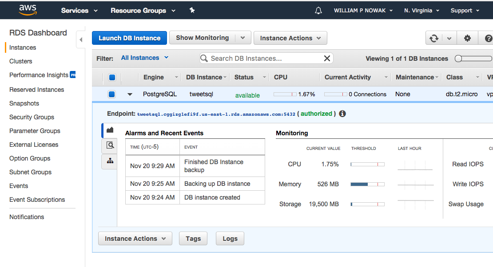

tweetsql
========

This was [forked](https://github.com/karlward/tweetsql) from Karl Ward - 11/20/17. Thanks @karlward! You should assume code and writing is his and not mine, unless it seems stupid, in which case that was probably me. 

Python module for storing Twitter data (from the streaming API) in a Postgres database, and operating on it via SQLAlchemy. Key differences between my work and @karlward:

- I an not using a local postgres database, but instead on in the cloud. As a result, I changed the installation/configuration slightly below to match what occurs in this directory. Do check out @karlward's work [here](https://github.com/karlward/tweetsql) if you want to see how to do this on a local postgres database.

Overview
========

This example code demonstrates the following: 
- connecting to the Twitter streaming API
- downloading tweets that match a search
- storing those tweets in a Postgres database
- storing related information (user, words) associated with each tweet in separate, related tables in a Postgres database
- accessing the database using the SQLAlchemy object relational mapper (ORM), which allows you to do your data manipulation in Python rather than SQL
- writing a GEXF graph file from the data in your database

Each of these topics is only briefly introduced.  This should get you on your way toward using these tools in your own projects.  Don't expect this code to make you a master of SQL, SQLAlchemy, ORM, or Python.  Or Twitter.  Why do you want to be a master of Twitter anyway?

The PostgreSQL database is used in this example because of its superior handling of Unicode (e.g. Emoji, Chinese, many non-Western languages).

Installation/configuration
==========================

Install PostgreSQL database server on AWS
----------------------------------

I followed these easy [instructions](https://aws.amazon.com/getting-started/tutorials/create-connect-postgresql-db/) to set up a postgreSQL. Once your instance is up and running, you'll need to note your DB endpoint. You can find it easily in the AWS console:

You will need to copy and paste this url (ending with amazonaws.com) to your postgres connection in the database.py file.

Optional pro step: create a Python virtualenv
---------------------------------------------

If you have virtualenv, then in Terminal, create a new virtual environment for this program: 

    mkdir -p ~/venv
    cd ~/venv
    virtualenv tweetsql
    source ~/venv/tweetsql/bin/activate

Note: if you set up a virtualenv, remember to use it throughout this example. 

Install dependencies with pip
-----------------------------

In Terminal: 

    export PATH=$PATH:/Applications/Postgres.app/Contents/Versions/9.4/bin
    pip install psycopg2 SQLAlchemy networkx twitter

Note: it's necessary to temporarily add the Postgres directory to your PATH environment variable, just so psycopg2 gets built properly by pip.  You can add it to your PATH permanently if you like, but you don't need to. 
 

Get the tweetsql code
---------------------

If you don't have it already, get the tweetsql code from Git: 

    mkdir -p ~/Code
    cd ~/Code
    git clone https://github.com/wnowak10/tweetsql.git

Setup your database schema
--------------------------

Before you can use the database you created, you have to tell Postgres what kind of data you want to store in it.  Luckily, SQLAlchemy does most of the work for you, you just have to run one Python function.  In Terminal: 

    cd ~/Code/tweetsql
    python
    import tweetsql.database
    import tweetsql.model
    tweetsql.database.init_db()
    exit()

The last command exits from the python interpreter, bringing you back to the shell prompt.

That should have setup your database schema, which means you have an empty database that is ready to store data in the right format.  

Add your Twitter keys and search string(s)
------------------------------------------

You have to add one file to use this code. Create a file called `secrets.py` and save you Twitter API information where appropriate below.

    CONSUMER_KEY = 'secret'
    CONSUMER_SECRET = 'secret'
    OAUTH_TOKEN = 'secret'
    OAUTH_TOKEN_SECRET = 'secret'

Run the load-stream.py script
-----------------------------

    cd ~/Code/tweetsql
    python load-stream.py

This script accesses the streaming API, downloading every tweet that matches the TRACK variable.  Whenever the script is running, any tweets that come in will be stored in the tweetsql Postgres database, along with records for the user that posted that tweet, and the words contained in each tweet.   

It's nice that you can leave this script running for a while (assuming you don't hit your rate limit), and you can restart it whenever you want.  The data will just keep going into the database, where you can manipulate it and query it in different ways later.  

Run the write-gexf.py script
----------------------------

    cd ~/Code/tweetsql
    python write-gexf.py

This script creates a GEXF file for a bipartite graph, with tweets as one type of node, and hashtags an another type of node.  Tweets are linked to hashtags they contain.  Though this is a bit of a contrived example, it shows the power that you get when you access the data through SQLAlchemy.  For example, if you want to iterate through all the tweets, that's relatively simple: 

    for t in db_session.query(Tweet).all():

Or just the most recent 500 tweets: 

    from sqlalchemy import desc
    for t in db_session.query(Tweet).order_by(desc(created_at))[0:500]:

If you want to access the words in a particular tweet:

    t.words

If you want to see the user who posted a particular tweet:

    t.user

Also, notice that the load-stream script stores the entire JSON for each tweet nin the tweet object's data field: 

    data = json.loads(t.data)

Or iterate through all the users you have seen, instead of all the tweets:

    for u in db_session.query(User).all():

And access the tweets you have captured for each user: 

    u.tweets

Poke around in the tweetsql model to learn how to roll your own
---------------------------------------------------------------

    cd ~/Code/tweetsql/tweetsql
    open model.py

Consider the following improvements: 
- better word splitting (handling punctuation, hashtags, @, .@, etc.)
- better parsing of the tweet using stop words, NLTK, etc.
- adding classes to the model for entities or other Twitter object types
- adapting this technique for Instagram or other APIs
- using this technique in your Twitter searches (rather than just the streaming API)

Learn more about SQLAlchemy
---------------------------

[http://docs.sqlalchemy.org/en/rel_0_9/](http://docs.sqlalchemy.org/en/rel_0_9/)

Learn more about SQL
--------------------

[http://www.postgresql.org/docs/9.3/static/index.html](http://www.postgresql.org/docs/9.3/static/index.html)

License and thanks
==================
Copyright 2014 Karl Ward

This example code and explanatory text is licensed under the GNU General Public License as published by the Free Software Foundation, either version 3 of the License, or (at your option) any later version.

See the file LICENSE for details.

This code was created within Gilad Lotan's Social Data Analysis course at NYU ITP during Fall 2014.  Respect and gratitude is due to Gilad.  

Jeff Ong helped refine and test these instructions. 
